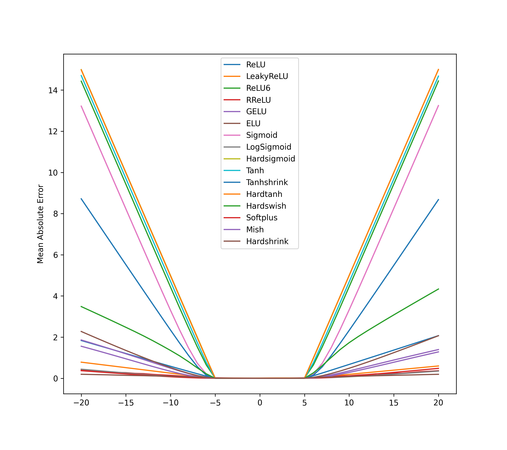

### Neural Arithmetic  
__*Understanding neural networks for arithmetic tasks*__

-----

#### Project structure
<!---* __*data*__ – train / test / val data for experiments (addition, subtraction, multiplication, division)-->
* __*src*__ – python source code for experiments
* __*report*__ – folder with the results of experiments
  

#### Experiments review
##### Experiment I: MLP with different activations

<!--- 
#### Guide
-->

Extrapolation failure:

Train data: [-5; 5]; Test data: [-20; 20]

##### Experiments II-III: Arithmetic operations
Interpolation RMSE (regarding ReLU baseline)  

|     |Relu6|	None|	NAC|	NALU|
| --- |  --- | --- | --- | --- |
|a + b|8.152|	0.000|	0.000|	0.342|
|a - b|14.059|	0.000|	0.000|	0.134|
|a * b|20.145|	1.615|	8.217|	5.951|
|a / b|0.234|	0.234|	0.948|	0.029|
|a ^ 2|33.546|	4.231|	8.276|	0.356|
|sqrt(a)|0.570|	0.571|	89.098|	0.048|
  

Extrapolation RMSE (regarding ReLU baseline)  

|     |Relu6|	None|	NAC|	NALU|
| --- |  --- | --- | --- | --- |
|a + b|78.540|	0.000|	0.000|	0.456|
|a - b|82.385|	0.000|	0.002|	0.432|
|a * b|96.773|	64.721|	80.192|	16.570|
|a / b|0.480|	1.901|	9.553|	5.276|
|a ^ 2|96.356|	66.948|	99.861|	16.480|
|sqrt(a)|20.078|	16.447|	54.132|	0.258|