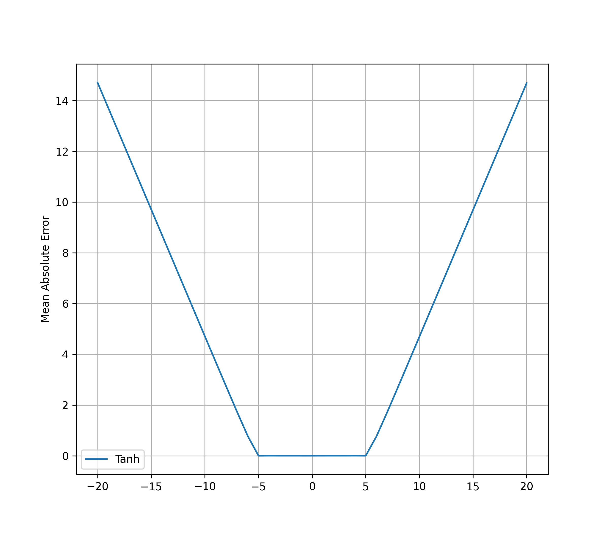

### Neural Arithmetic  
__*Understanding neural networks for arithmetic tasks*__

-----

#### Project structure
<!---* __*data*__ – train / test / val data for experiments (addition, subtraction, multiplication, division)-->
* __*src*__ – python source code for experiments  
*(now empty because code in cleaning process)*
* __*notebooks*__ – Jupyter Notebooks with models training, extra experiments and other various stuff 
* __*report*__ – folder with the results of experiments
  

#### Experiments review
##### Experiment I: MLP with different activations
Extrapolation failure result:

*Train data: [-5; 5], Test data: [-20; 20]*  
*More activation functions in future updates*
<!--- 
#### Guide
-->